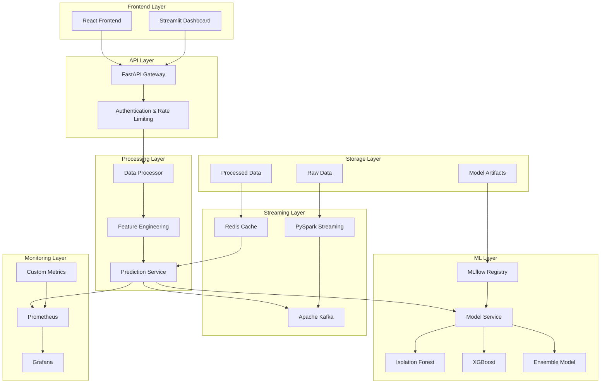
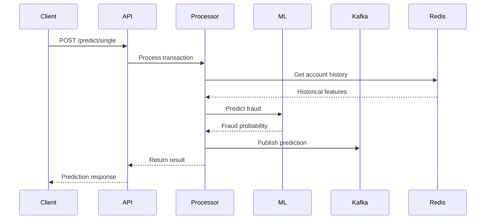
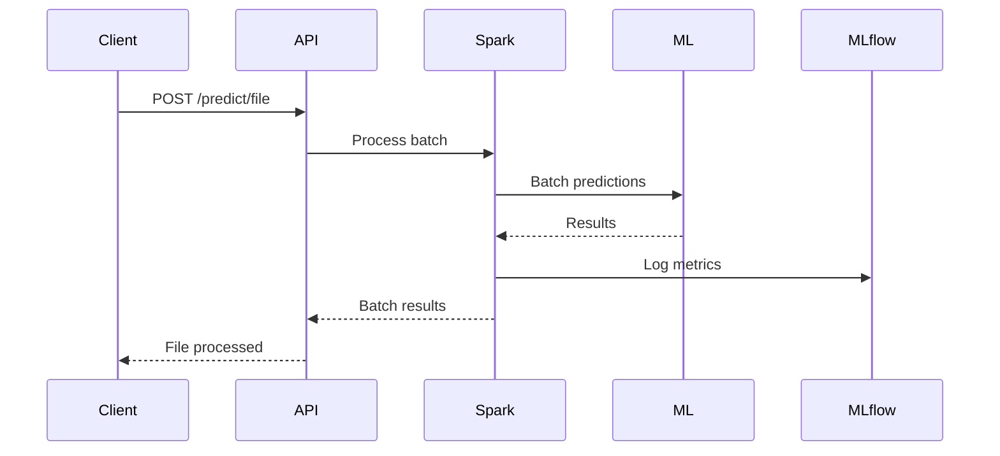
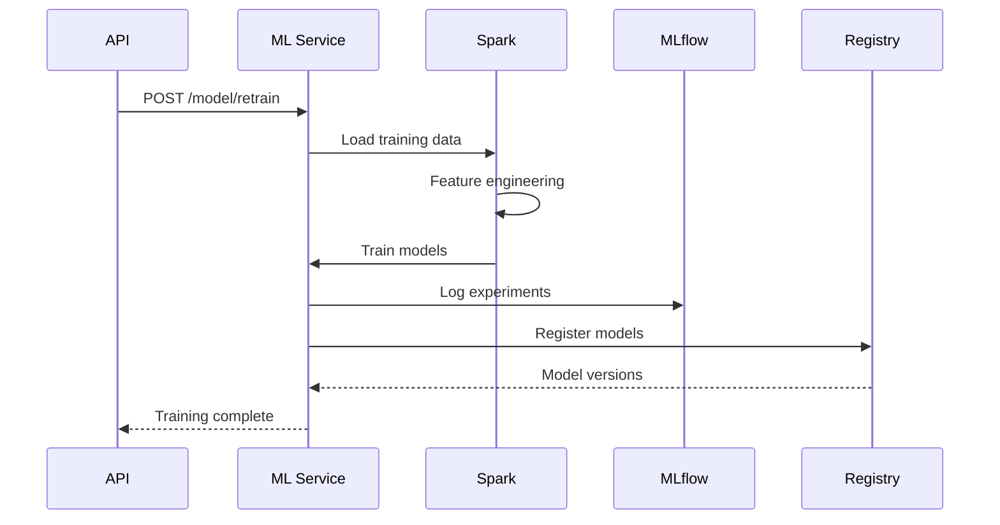

# Architecture Technique

## Vue d'ensemble

Le système de détection de fraude financière est architecturé autour d'un pipeline de traitement en temps réel utilisant des technologies modernes de streaming et de machine learning.

## Architecture Globale



## Composants Principaux

### 1. Frontend Layer

#### React Application
- **Framework**: React 18+ avec Ant Design
- **Fonctionnalités**: 
  - Dashboard temps réel
  - Upload de fichiers
  - Saisie manuelle de transactions
  - Analytics avancées
  - Configuration système

#### Streamlit Dashboard
- **Framework**: Streamlit
- **Fonctionnalités**:
  - Monitoring en temps réel
  - Visualisations interactives
  - Métriques système
  - Alertes

### 2. API Gateway

#### FastAPI
- **Version**: 0.104+
- **Fonctionnalités**:
  - REST API endpoints
  - Validation automatique
  - Documentation OpenAPI
  - Async/await support
  - CORS middleware

#### Endpoints Principaux
- `/predict/*` - Prédictions
- `/health` - Health check
- `/metrics` - Métriques
- `/model/*` - Gestion modèles

### 3. Processing Layer

#### Data Processor
- **Technologie**: PySpark + Pandas
- **Fonctionnalités**:
  - Feature engineering
  - Validation de données
  - Gestion des erreurs
  - Caching avec Redis

#### Feature Engineering
```python
# Features principales
- amount_log, amount_sqrt
- balance_change_orig/dest
- error_orig/dest (indicateurs de fraude)
- transaction_type_encoded
- time_features (hour, day_of_week, is_weekend, is_night)
- behavioral_features (historique compte)
```

#### Prediction Service
- **Architecture**: Async/await
- **Fonctionnalités**:
  - Prédictions temps réel
  - Streaming Kafka
  - Cache Redis
  - Monitoring latence

### 4. Machine Learning Layer

#### Modèles Implémentés

##### Isolation Forest
- **Algorithme**: Unsupervised anomaly detection
- **Contamination**: 0.1 (10% anomalies attendues)
- **Features**: 23 features engineered
- **Performance**: ~85% accuracy

##### XGBoost
- **Algorithme**: Gradient boosting
- **Objective**: binary:logistic
- **Hyperparamètres**: Grid search CV
- **Performance**: ~94% accuracy

##### Ensemble Model
- **Stratégie**: Weighted voting
- **Poids**: Isolation Forest (30%), XGBoost (70%)
- **Performance**: ~96% accuracy

#### MLflow Integration
- **Tracking**: Expérimentations automatiques
- **Registry**: Version des modèles
- **Artifacts**: Models et scalers
- **Deployment**: Production/Staging

### 5. Streaming Layer

#### Apache Kafka
- **Topics**:
  - `transactions`: Transactions entrantes
  - `fraud_predictions`: Prédictions sortantes
  - `model_metrics`: Métriques modèles
- **Configuration**: 1 broker, 3 partitions
- **Retention**: 7 days

#### PySpark Structured Streaming
- **Window**: 5 minutes micro-batches
- **Checkpointing**: HDFS/S3
- **Schema Evolution**: Gestion automatique
- **Fault Tolerance**: Exactly-once semantics

#### Redis Cache
- **Purpose**: Features temps réel
- **TTL**: 24 heures
- **Data Structures**: Hash pour comptes
- **Performance**: <1ms lookup

### 6. Monitoring Layer

#### Prometheus
- **Port**: 8001
- **Metrics**:
  - Prediction latency
  - Error rates
  - System resources
  - Model performance

#### Grafana
- **Dashboards**:
  - System Overview
  - Model Performance
  - Business Metrics
  - Alert Management

#### Custom Metrics
```python
# Métriques principales
- fraud_predictions_total
- prediction_latency_seconds
- model_accuracy
- system_health_score
- kafka_consumer_lag
```

## Flux de Données

### 1. Transaction Input



### 2. Batch Processing



### 3. Model Training



## Patterns Architecturaux

### 1. Microservices Architecture
- **Avantages**: Scalabilité indépendante
- **Communication**: REST + Kafka
- **Discovery**: Docker Compose
- **Configuration**: Environment variables

### 2. Event-Driven Architecture
- **Events**: Transactions, predictions, metrics
- **Processing**: Async avec Kafka
- **Backpressure**: Gestion automatique
- **Replay**: Replay des events si besoin

### 3. CQRS Pattern
- **Command**: Write operations (predictions)
- **Query**: Read operations (analytics)
- **Separation**: API endpoints séparés
- **Optimization**: Read models optimisés

### 4. Circuit Breaker Pattern
- **Implementation**: Retry + timeout
- **Fallback**: Modèles par défaut
- **Monitoring**: Health checks
- **Recovery**: Auto-recovery

## Scalabilité

### Horizontal Scaling

#### API Layer
- **Load Balancer**: Nginx/HAProxy
- **Instances**: Multiple FastAPI containers
- **Session**: Stateless design
- **Database**: Connection pooling

#### Processing Layer
- **Spark Cluster**: Master + workers
- **Kafka Partitions**: Increase throughput
- **Redis Cluster**: Sharding
- **Model Serving**: Multiple instances

### Vertical Scaling

#### Resources
- **CPU**: 4+ cores per instance
- **Memory**: 8GB+ per instance
- **Storage**: SSD for I/O intensive
- **Network**: 1Gbps+ bandwidth

## Sécurité

### 1. Authentication & Authorization
- **JWT**: Token-based auth
- **RBAC**: Role-based access
- **API Keys**: External integration
- **OAuth2**: Third-party access

### 2. Data Protection
- **Encryption**: TLS 1.3
- **PII**: Masking/anonymization
- **Audit**: Access logging
- **Compliance**: GDPR/PCI-DSS

### 3. Network Security
- **Firewall**: Port restrictions
- **VPN**: Private network
- **WAF**: Web application firewall
- **DDoS**: Rate limiting

## Performance Optimization

### 1. Caching Strategy
- **Redis**: Hot data
- **Memory**: Model caching
- **CDN**: Static assets
- **Database**: Query optimization

### 2. Query Optimization
- **Indexing**: Proper indexes
- **Partitioning**: Time-based
- **Batching**: Bulk operations
- **Async**: Non-blocking I/O

### 3. Model Optimization
- **Quantization**: Reduce model size
- **Pruning**: Remove unnecessary features
- **Batch inference**: Vectorized operations
- **GPU**: Acceleration if available

## Déploiement

### 1. Container Strategy
- **Docker**: All services containerized
- **Multi-stage**: Optimized images
- **Health checks**: Built-in monitoring
- **Resource limits**: Memory/CPU constraints

### 2. Orchestration
- **Docker Compose**: Development
- **Kubernetes**: Production
- **Helm Charts**: Package management
- **GitOps**: Automated deployment

### 3. CI/CD Pipeline
- **Build**: Automated testing
- **Test**: Unit + integration tests
- **Deploy**: Blue-green deployment
- **Monitor**: Rollback capability

## Monitoring & Observability

### 1. Logging
- **Structured**: JSON format
- **Centralized**: ELK stack
- **Correlation**: Request tracing
- **Retention**: 30 days

### 2. Metrics
- **Business**: Fraud rate, accuracy
- **Technical**: Latency, throughput
- **Infrastructure**: CPU, memory
- **Application**: Error rates

### 3. Tracing
- **Distributed**: OpenTelemetry
- **Sampling**: 1% of requests
- **Visualization**: Jaeger
- **Alerting**: Threshold-based

## Gestion des Données

### 1. Data Lake Architecture
- **Raw**: Immutable source data
- **Processed**: Cleaned features
- **Curated**: Model-ready data
- **Serving**: Real-time access

### 2. Data Governance
- **Quality**: Validation rules
- **Lineage**: Data provenance
- **Privacy**: PII handling
- **Retention**: Data lifecycle

### 3. Backup & Recovery
- **Snapshots**: Daily backups
- **Replication**: Multi-region
- **Disaster Recovery**: RTO < 1 hour
- **Testing**: Regular drills

## Évolution Future

### 1. Advanced ML
- **Deep Learning**: Neural networks
- **Online Learning**: Continuous training
- **Explainability**: SHAP/LIME
- **Fairness**: Bias detection

### 2. Real-time Enhancements
- **Complex Event Processing**: ESPER
- **Graph Analytics**: Network analysis
- **Anomaly Detection**: Advanced algorithms
- **Predictive Analytics**: Forecasting

### 3. Integration
- **Blockchain**: Immutable audit trail
- **External APIs**: Third-party data
- **Cloud Native**: AWS/Azure/GCP
- **Edge Computing**: Local processing
