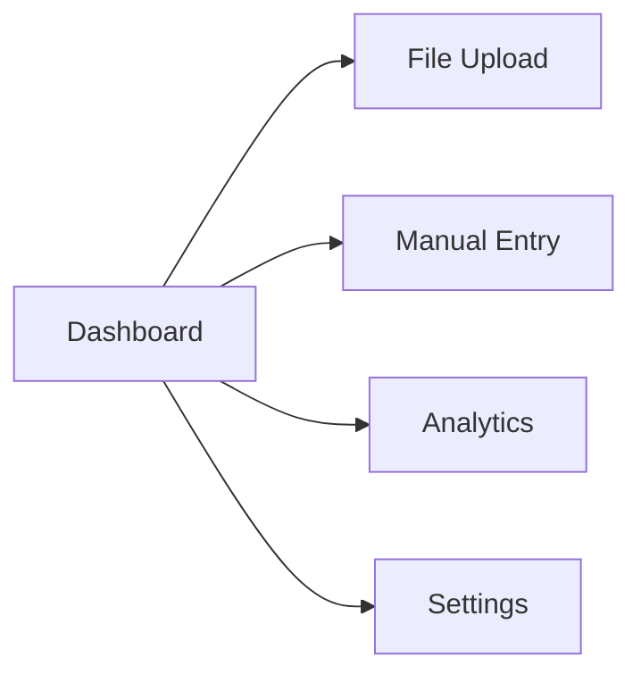

# Guide Utilisateur - Système de Détection de Fraude

## Table des Matières

1. [Introduction](#introduction)
2. [Interface Web](#interface-web)
3. [Upload de Fichiers](#upload-de-fichiers)
4. [Saisie Manuelle](#saisie-manuelle)
5. [Dashboard Analytics](#dashboard-analytics)
6. [Configuration](#configuration)
7. [Interprétation des Résultats](#interprétation-des-résultats)
8. [Bonnes Pratiques](#bonnes-pratiques)
9. [Dépannage](#dépannage)

## Introduction

Le système de détection de fraude financière offre une interface complète pour analyser les transactions en temps réel et identifier les activités frauduleuses. Ce guide vous explique comment utiliser efficacement toutes les fonctionnalités.

### Points Clés

- **Précision**: >95% de détection de fraude
- **Latence**: <100ms par transaction
- **Support**: CSV, JSON, et saisie manuelle
- **Monitoring**: Dashboard temps réel

## Interface Web

### Accès

1. **Frontend React**: http://localhost:3000
2. **Dashboard Streamlit**: http://localhost:8501
3. **API Documentation**: http://localhost:8000/docs

### Navigation Principale



#### 1. Dashboard
Vue d'ensemble en temps réel avec:
- Métriques système
- Prédictions récentes
- Alertes actives
- Statistiques de performance

#### 2. File Upload
Analyse par lots de transactions via fichiers.

#### 3. Manual Entry
Saisie individuelle de transactions.

#### 4. Analytics
Analyses détaillées et tendances.

#### 5. Settings
Configuration du système.

## Upload de Fichiers

### Formats Supportés

#### CSV Format
```csv
transaction_id,type,amount,oldbalanceOrg,newbalanceOrig,oldbalanceDest,newbalanceDest,nameOrig,nameDest
TXN001,TRANSFER,15000,50000,35000,20000,35000,C123456789,M987654321
TXN002,PAYMENT,500,8000,7500,3000,3500,C234567890,M123456789
TXN003,CASH-OUT,2000,15000,13000,10000,12000,C345678901,M234567890
```

#### JSON Format
```json
[
  {
    "transaction_id": "TXN001",
    "type": "TRANSFER",
    "amount": 15000.0,
    "oldbalanceOrg": 50000.0,
    "newbalanceOrig": 35000.0,
    "oldbalanceDest": 20000.0,
    "newbalanceDest": 35000.0,
    "nameOrig": "C123456789",
    "nameDest": "M987654321"
  }
]
```

### Étapes d'Upload

1. **Naviguer** vers "File Upload"
2. **Glisser-déposer** ou cliquer pour sélectionner
3. **Vérifier** le format et la taille (<50MB)
4. **Cliquer** sur "Upload & Analyze"
5. **Attendre** le traitement
6. **Examiner** les résultats

### Résultats d'Analyse

#### Résumé
- **Total Transactions**: Nombre analysé
- **Transactions Frauduleuses**: Détection de fraude
- **Taux de Fraude**: Pourcentage de fraude
- **Temps de Traitement**: Performance

#### Détails par Transaction
- **ID Transaction**: Identifiant unique
- **Probabilité de Fraude**: Score 0-100%
- **Statut**: FRAUD/LEGITIMATE
- **Confiance**: Fiabilité de la prédiction

## Saisie Manuelle

### Champs Requis

| Champ | Description | Exemple |
|-------|-------------|---------|
| Transaction ID | Identifiant unique | TXN_001 |
| Type | Type de transaction | TRANSFER |
| Amount | Montant ($) | 15000 |
| Old Balance Orig | Solde avant (origine) | 50000 |
| New Balance Orig | Solde après (origine) | 35000 |
| Old Balance Dest | Solde avant (destination) | 20000 |
| New Balance Dest | Solde après (destination) | 35000 |
| Name Orig | Compte origine | C123456789 |
| Name Dest | Compte destination | M987654321 |

### Types de Transactions

- **CASH-IN**: Dépôt d'argent
- **CASH-OUT**: Retrait d'argent
- **TRANSFER**: Virement entre comptes
- **PAYMENT**: Paiement de biens/services
- **DEBIT**: Débit direct

### Validation Automatique

Le système vérifie automatiquement:
- **Cohérence des soldes**: `old - new = amount`
- **Formats des IDs**: C/M + 9 chiffres
- **Montants positifs**: > 0
- **Types valides**: 5 types supportés

### Analyse en Temps Réel

Après saisie, le système affiche:
- **Score de Fraude**: Probabilité 0-100%
- **Niveau de Risque**: Very Low à Very High
- **Facteurs de Risque**: Features influentes
- **Informations Modèle**: Version et performance

## Dashboard Analytics

### Métriques Principales

#### Performance Système
- **Prédictions Totales**: Cumul depuis le démarrage
- **Taux de Fraude**: Pourcentage actuel
- **Latence Moyenne**: Temps de réponse moyen
- **Débit**: Transactions par seconde

#### Tendances Temporelles
- **Volume 24H**: Transactions par heure
- **Taux de Fraude 24H**: Évolution du risque
- **Patterns**: Pics et tendances

### Analyses Avancées

#### Distribution par Type


#### Patterns de Fraude
- **Heures à risque**: 2AM-6AM
- **Types à risque**: TRANSFER, CASH-OUT
- **Montants seuils**: >$10,000
- **Comportements inhabituels**: Nouveaux comptes

#### Feature Importance
1. **Amount log**: Montant transformé
2. **Balance change**: Variation de solde
3. **Error indicators**: Incohérences
4. **Time features**: Moment de la transaction
5. **Account history**: Historique du compte

### Alertes et Monitoring

#### Types d'Alertes
- **Critique**: Haute latence, système down
- **Warning**: Taux de fraude élevé, ressources
- **Info**: Mise à jour modèles, maintenance

#### Actions Recommandées
- **Haute latence**: Vérifier charge système
- **Taux fraude élevé**: Investigation manuelle
- **Modèle obsolète**: Retraining recommandé

## Configuration

### Paramètres Modèles

#### Seuils de Détection
- **Fraud Threshold**: 0.5 (défaut)
- **Confidence Threshold**: 0.7 (défaut)
- **Impact**: Sensibilité du système

#### Performance
- **Batch Size**: 100 transactions
- **Max Latency**: 100ms
- **Monitoring Interval**: 30s

### Alertes
- **High Fraud Rate**: >5%
- **System Health**: Ressources >80%
- **Model Performance**: Accuracy <90%

### Automation
- **Auto Retrain**: Désactivé par défaut
- **Model Updates**: Manuelles
- **Cache TTL**: 24 heures

## Interprétation des Résultats

### Échelle de Risque

| Probabilité | Niveau de Risque | Action |
|-------------|------------------|--------|
| 0-20% | Very Low | Traitement normal |
| 20-40% | Low | Monitoring standard |
| 40-60% | Medium | Vérification manuelle |
| 60-80% | High | Investigation requise |
| 80-100% | Very High | Blocage immédiat |

### Facteurs de Risque

#### Indicateurs Positifs (Risque)
- **Montant élevé**: >$10,000
- **Type risqué**: TRANSFER, CASH-OUT
- **Incohérence solde**: `old - new != amount`
- **Heure inhabituelle**: 2AM-6AM
- **Nouveau compte**: <5 transactions

#### Indicateurs Négatifs (Sécurité)
- **Montant faible**: <$100
- **Type sûr**: CASH-IN, PAYMENT
- **Cohérence parfaite**: Soldes corrects
- **Heures normales**: 9AM-6PM
- **Compte établi**: >100 transactions

### Confiance de Prédiction

- **>90%**: Très fiable
- **80-90%**: Fiable
- **70-80%**: Moyennement fiable
- **<70%**: Faible fiabilité

### Exemples Concrets

#### Transaction Normale
```json
{
  "transaction_id": "NORMAL_001",
  "type": "PAYMENT",
  "amount": 250,
  "fraud_probability": 0.05,
  "risk_level": "Very Low",
  "factors": ["Low amount", "Safe type", "Normal hours"]
}
```

#### Transaction Suspecte
```json
{
  "transaction_id": "SUSPECT_001",
  "type": "TRANSFER",
  "amount": 25000,
  "fraud_probability": 0.85,
  "risk_level": "High",
  "factors": ["High amount", "Risky type", "Unusual time", "Balance mismatch"]
}
```

## Bonnes Pratiques

### Préparation des Données

#### Fichiers CSV
- **Headers**: Utiliser les noms exacts
- **Encodage**: UTF-8
- **Délimiteurs**: Virgules (,)
- **Décimales**: Points (.)

#### Validation
- **Vérifier** les IDs uniques
- **Valider** les montants positifs
- **Contrôler** les types de transactions
- **Nettoyer** les données aberrantes

### Utilisation Optimale

#### Volume de Traitement
- **Petits volumes**: <1K transactions (temps réel)
- **Volumes moyens**: 1K-10K (batch processing)
- **Grands volumes**: >10K (scheduled processing)

#### Fréquence d'Analyse
- **Monitoring continu**: Dashboard temps réel
- **Analyse quotidienne**: Rapports automatisés
- **Analyse hebdomadaire**: Tendances et patterns
- **Analyse mensuelle**: Performance globale

### Sécurité

#### Données Sensibles
- **Anonymiser**: PII si nécessaire
- **Chiffrer**: Transfert HTTPS
- **Limiter**: Accès par rôle
- **Auditer**: Logs d'accès

#### Conformité
- **GDPR**: Protection données personnelles
- **PCI-DSS**: Normes paiement
- **Audit**: Traçabilité complète

## Dépannage

### Problèmes Communs

#### Upload Échoué
- **Vérifier** format (CSV/JSON)
- **Contrôler** taille (<50MB)
- **Valider** headers obligatoires
- **Nettoyer** données corrompues

#### Prédiction Lente
- **Vérifier** charge système
- **Redémarrer** services si besoin
- **Optimiser** taille des batches
- **Surveiller** ressources

#### Résultats Incohérents
- **Valider** données d'entrée
- **Vérifier** cohérence soldes
- **Contrôler** formats de types
- **Examiner** logs d'erreurs

### Messages d'Erreur

#### Erreurs de Validation
```
"Invalid transaction type: INVALID_TYPE"
"Amount must be positive: -1000"
"Missing required field: transaction_id"
```

#### Erreurs Système
```
"Service unavailable: Model not loaded"
"Connection timeout: Redis"
"Kafka producer error: Broker not reachable"
```

#### Solutions
1. **Corriger** format des données
2. **Vérifier** configuration système
3. **Redémarrer** services nécessaires
4. **Contacter** support technique

### Performance

#### Optimisation
- **Batch size**: Ajuster selon volume
- **Cache**: Activer Redis
- **Monitoring**: Surveiller latence
- **Resources**: Allouer suffisamment

#### Limites
- **Max file size**: 50MB
- **Max batch size**: 10K transactions
- **Max concurrent**: 100 requests/second
- **Timeout**: 30 seconds

### Support Technique

#### Informations à Fournir
1. **Screenshot** de l'erreur
2. **Logs** système récents
3. **Fichier** d'exemple (anonymisé)
4. **Étapes** de reproduction

#### Canaux de Support
- **Documentation**: Guides détaillés
- **Logs**: Systeme et application
- **Issues**: GitHub repository
- **Email**: Équipe de développement

---

## Conclusion

Ce système de détection de fraude offre une solution complète et performante pour la surveillance des transactions financières. En suivant ce guide, vous pourrez utiliser efficacement toutes les fonctionnalités et interpréter correctement les résultats pour protéger vos opérations contre la fraude.

Pour toute question supplémentaire ou problème technique, n'hésitez pas à consulter la documentation technique ou contacter l'équipe de support.
